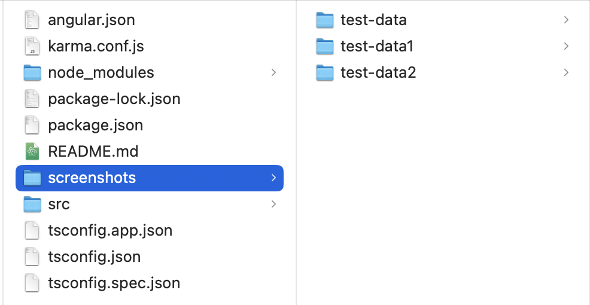

# Charts Dashboard Challenge

This project was generated with [Angular CLI](https://github.com/angular/angular-cli) version 13.1.2.

## Dependencies
- Chart.js with ng2-charts and zoom plugin
- Angular material
- Bootstrap 5
- lodash
- Moment.js

## Test Data
- Test data for all 3 charts are located in the `src/app/data/mock-data.ts` file. 
- Exported as constants of `DATA`, `DATA1` and `DATA2`.
- In the `dashboard-data.service.ts` file, replace the import of DATA file with any of the exported data.

## Screenshots of Charts
- Screenshots of the charts with each of the test data are located in the `/screenshots` directory, and under each sub-folders named after the test data.

## Development server

Run `ng serve` for a dev server. Navigate to `http://localhost:4200/`. The app will automatically reload if you change any of the source files.

## Code scaffolding

Run `ng generate component component-name` to generate a new component. You can also use `ng generate directive|pipe|service|class|guard|interface|enum|module`.

## Build

Run `ng build` to build the project. The build artifacts will be stored in the `dist/` directory.

## Running unit tests

Run `ng test` to execute the unit tests via [Karma](https://karma-runner.github.io).

## Running end-to-end tests

Run `ng e2e` to execute the end-to-end tests via a platform of your choice. To use this command, you need to first add a package that implements end-to-end testing capabilities.

## Further help

To get more help on the Angular CLI use `ng help` or go check out the [Angular CLI Overview and Command Reference](https://angular.io/cli) page.
